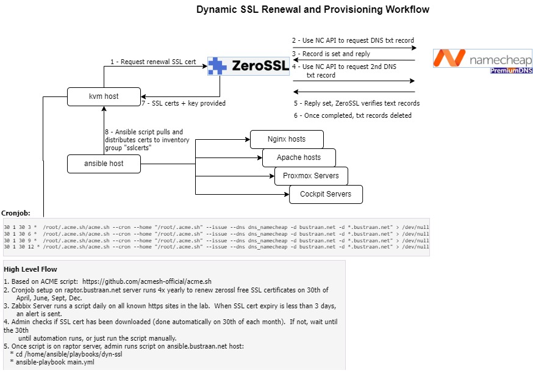
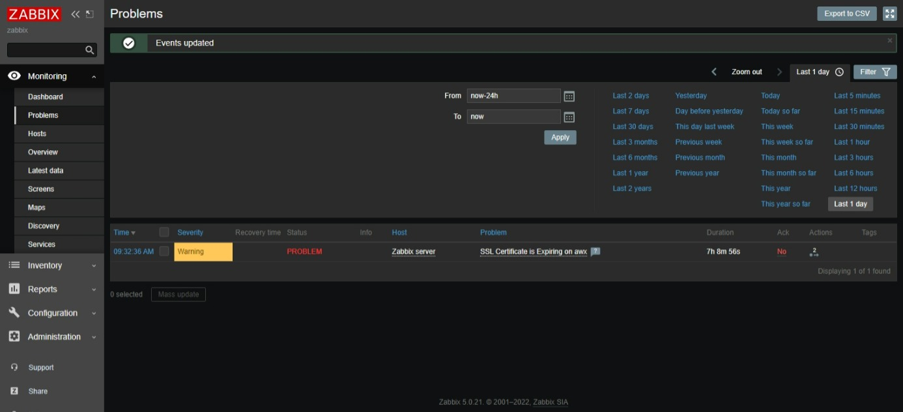
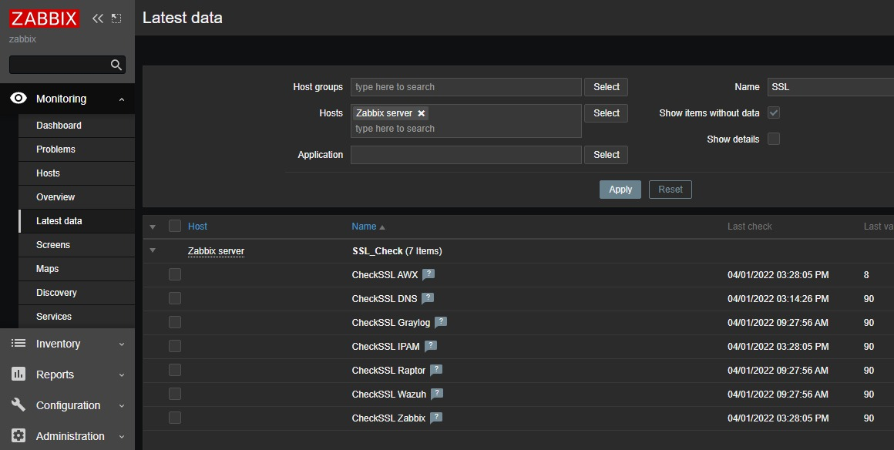
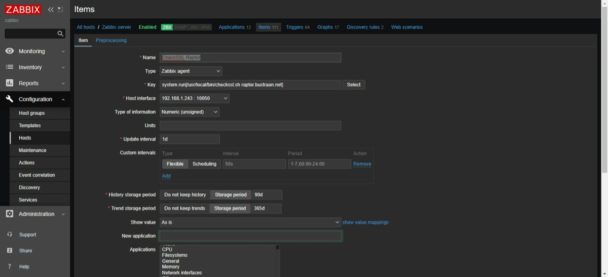
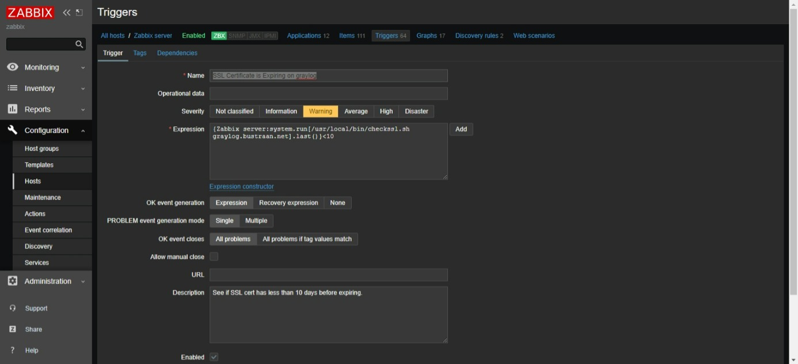

## Dynamic SSL Updater

### Operational Overview
1. ACME cronjob is executed every 90 days on on raptor.bustraan.net (KVM host) and it can renew free wildcard SSL certificate ever 90 day from zerossl.com or letsencrypt.com. Note: you need an account with API keys with your domain provided for this integration to succeed.

2. Ansible playbook 
  - Downloads latest certificates from Raptor.
  - Copies certs by OS-type and installed package type (nginx, httpd, pveproxy, cockpit) to correct directory and filename formats. 
  - Restart appropriate server processes

### Monitoring
* A Bash script, checkssl.sh runs on the Zabbix server daily to check for days remaining. Trigger will alert when there are only 3 days remaining on the certificate (certificate life is 90 days)
---
### Solution Overview Diagram

### Sample Zabbix Screens
#### Problem Detected in Zabbix

#### Latest Data

#### Setup a new Item

#### Setup a new Trigger

### Additional ToDo:
* Add foreman certificates suppport - checks for Apache and foreman installed on host - DONE
* Prometheus and Grafana hosts should be added to "sslcerts" group - added nginx reverse proxy in front of service port - DONE
* Add Proxmox cluster UI and API certificates to scripts - workflow is documented - DONE
* Modify foreman certificate locations to not interfere with Puppet and SmartProxy certificates - DONE
